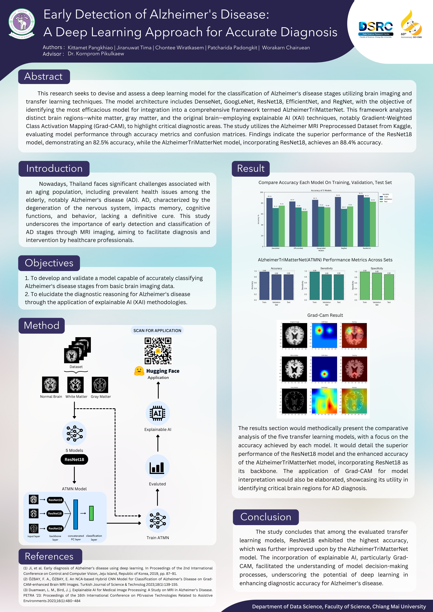

# Early Detection of Alzheimer's Disease: A Deep Learning Approach for Accurate Diagnosis

This project implemented and validated a deep learning model for classifying Alzheimer's disease stages from brain imaging data, incorporating explainable AI (XAI) methodologies. We developed our AlzheimerTriMatterNet (ATMN) using ResNet18 as the backbone due to its superior performance. This model uses a Multi-stream CNN architecture with three parallelized ResNet18 models, each focusing on different brain components.

## Dataset  
https://www.kaggle.com/datasets/sachinkumar413/alzheimer-mri-dataset

## Huggingface🤗 Space  
https://huggingface.co/spaces/Jiranuwat/AlzheimerDetection

## Poster  
